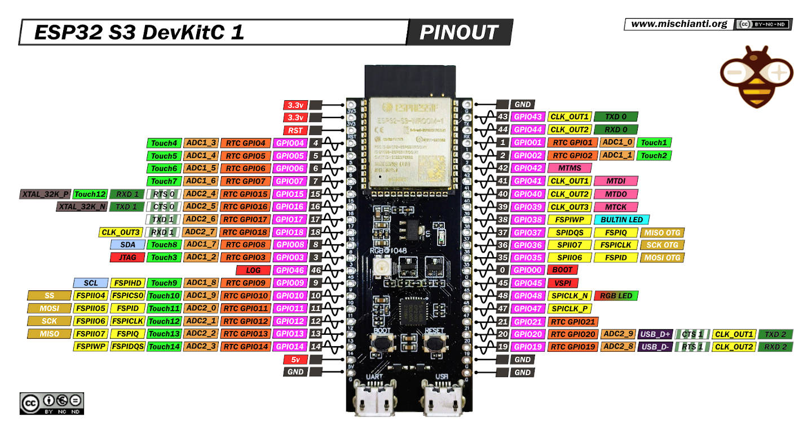
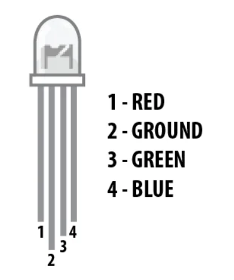
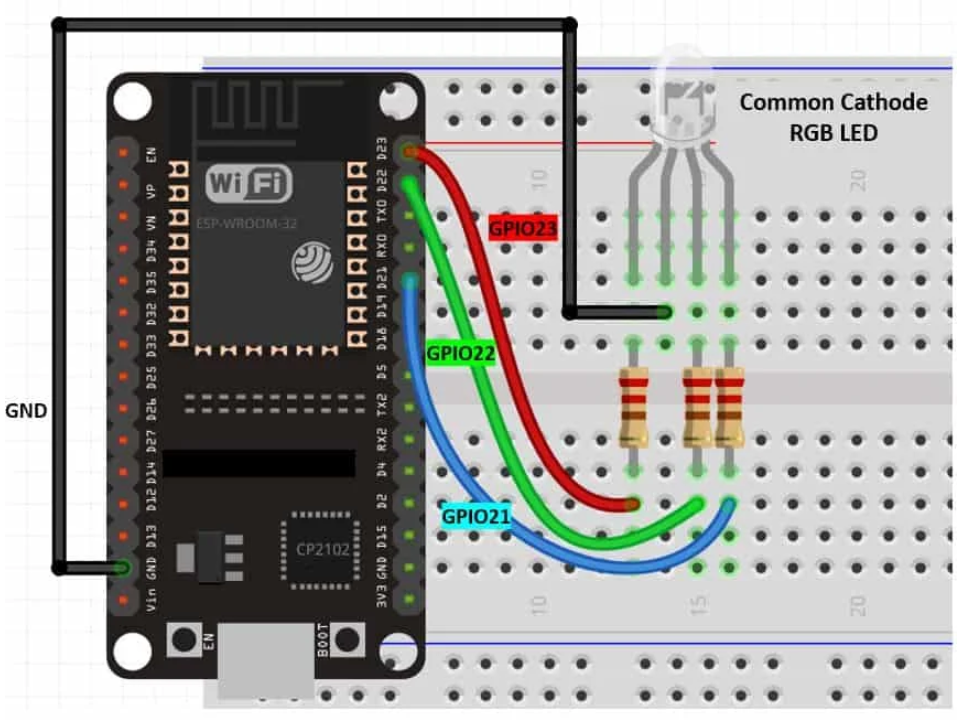
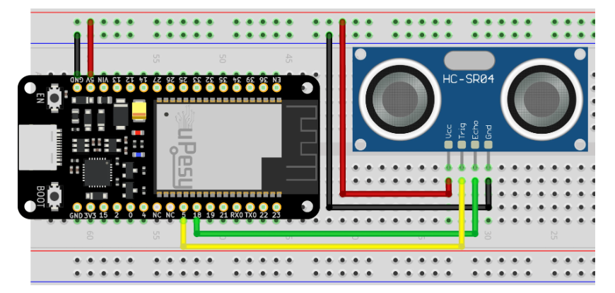
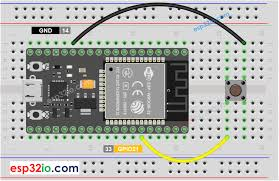
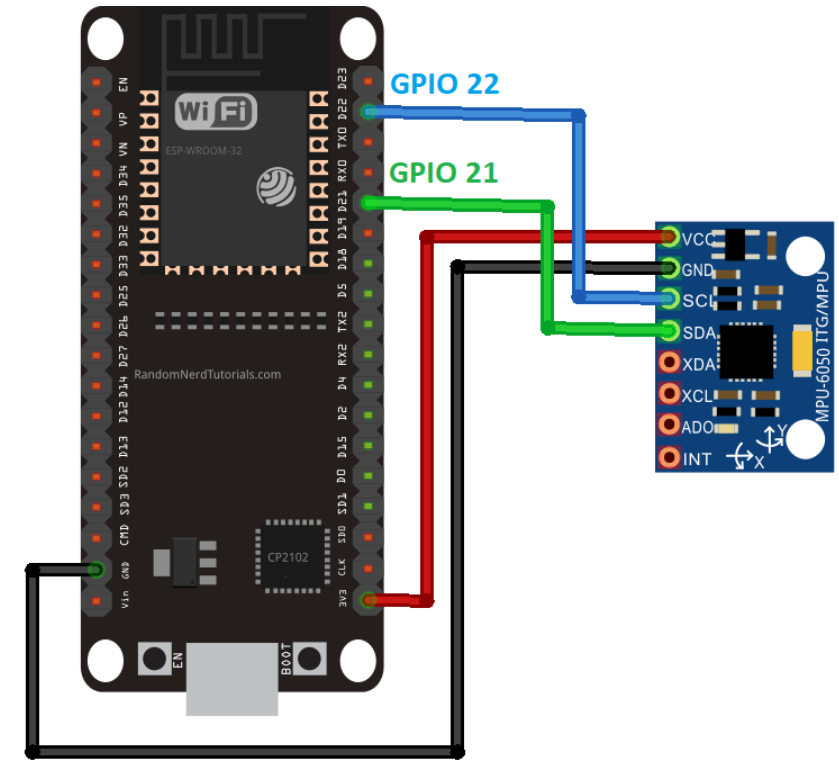
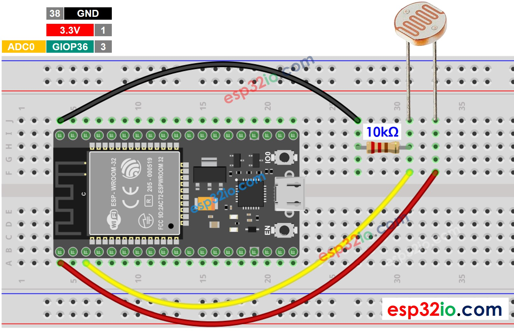
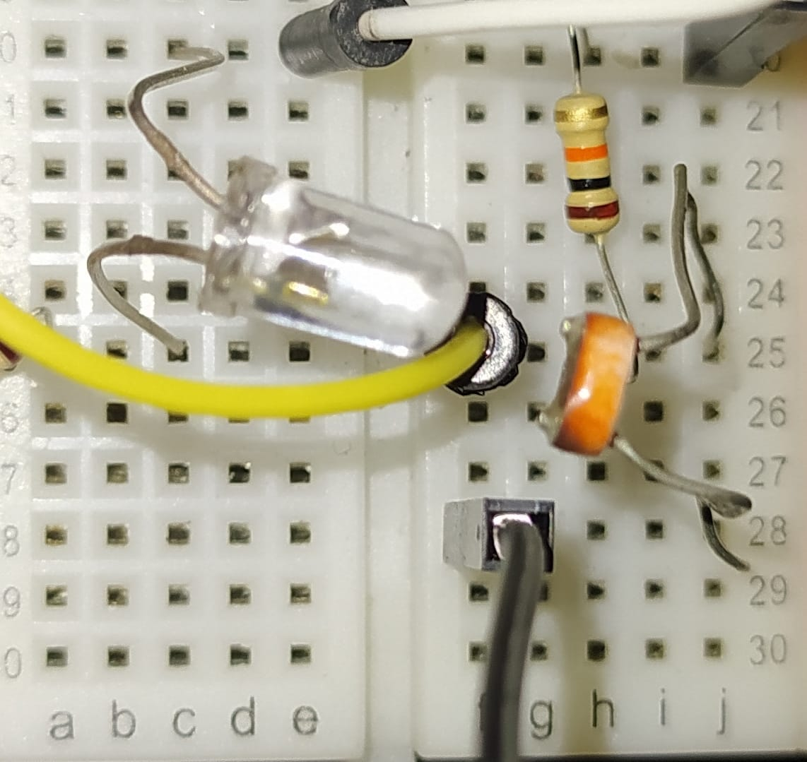

# LAB 2 - Sensors
**Total tasks:** 3 (1 in-lab, 2 take-home)

**Take Home Deadline:** March 10th

**Submission instructions:** Submit the `.ino` files, for all the tasks in the format `taskX.ino`, where `X` is the task number. Submission tab will be made available on LMS. For the in-lab task, a separate LMS submission tab is available.

## ESP-32 S3 Board:

## Hardware Introduction:

### RGB LED:

RGB (Red-Green-Blue) LEDs are actually three LEDs in one but that does not mean it can only make three colors. As red, green, and blue are the additive primary colors, you can control the intensity of each. Most RGB LEDs have four pins: one for each color, and a ground.

The three LEDS of the RGB connect to three GPIO pins.

The file `rgb-demo.ino` shows an example of how to use a RGB led.

### Ultrasonic Sensor:

An ultrasonic sensor is a device that uses sound waves to measure distances. It emits high-frequency sound pulses and calculates the time it takes for the echo to return after bouncing off an object. This allows it to determine the distance between the sensor and the object.

The trig and echo pins are controlled using GPIOs.

Example code can be found in the file `sonar-demo.ino`.

### Button:

### Accelerometer:

The MPU6050 is a 6-axis motion tracking sensor that includes a 3-axis accelerometer and a 3-axis gyroscope in a single chip. The accelerometer measures acceleration along the X, Y, and Z axes, helping to detect movement, tilt, and orientation. The gyroscope tracks angular velocity, allowing for precise motion tracking.

The MPU6050 communicates with microcontrollers via the I2C protocol.

Note: The setup shown above is with another esp board. You can find the SDA and SCL enabled GPIOs for the S3 board above.

### LDR:
LDR (short for Light Dependent Resistor) can be used to sense the relative presence or absence of light. Also known as a "photoresistor", or a "photocell", LDR is a passive component that varies its resistance based on the luminosity of the light incident to its surface. The resistance of a photoresistor decreases with increase in incident light intensity; in other words, it exhibits photoconductivity.

The physical property of the LDR that changes directly is the resistance, which can't be directly measured by a microcontroller, however, MCUs can easily measure voltage; they have built-in ADCs. You can find the ADC enabled pins for the ESP32-S3 above.

## In-lab task:

### Task 1 - Security system with utlrasonic distance sensor:
Your first task is to implement a simple intrusion detection system. Suppose your implementation will be used with a door, and the micro-controller uses an LED light to indicate wehether their is unauthorized access or not. The LED should blink green under normal circumstances; however, if someone unauthorized comes within range of the sensor (i.e distance falls below a defined threshold), the LED should start blinking RED. This LED should keep on blinking RED until someone takes action (add a simple push-down button, which, once pressed, resets the LED back to normal).​

You may find the source file `sonar-demo.ino` helpful as a starting point.

## Take-home tasks:

### Task 2 - Orientation and Movement Monitoring System

Your task is to implement a motion detection and orientation monitoring system using the **MPU6050** accelerometer and gyroscope sensor. The system should detect acceleration in the **X, Y, and Z axes** and display movement status using an **RGB LED**.

The RGB LED should indicate different states based on movement levels:

- 🔵 **Blue**: If the sensor detects a temperature exceeding a predefined threshold.
- 🟢 **Green**: When the sensor remains stationary.
- 🟡 **Yellow**: When low movement is detected (moderate acceleration).
- 🔴 **Red**: When high movement is detected (acceleration exceeds a threshold).

- **Dynamically set thresholds** during testing (**avoid hardcoded values**).
- **Display raw sensor values** on the **Serial Monitor**, including:
  - Acceleration (X, Y, Z)
  - Rotation (X, Y, Z)
  - Temperature

Note:
- Refer to the `accelerometerDemo.ino` file as a starting point.

### Task 3 - Sending data over... light?
In this task, let's try to extend the light sensing capabilities of an LDR, and a simple LED light to build a simple Light Fidelity based transmission medium. 

If the LED can be controlled to blink with certain patterns, we can induce different voltage levels at the LDR pin. Specifically, if the ambient light is low enough, and is removed as noise from the data, and if the LED is directly facing the LDR, we can detect flashes of pattterns of light as rapidly falling and increasing values. (Hint: 0s and 1s)

*Placing LED and LDR directly opposite to each other for better transmission(LED : row 20, 25) and reception (LDR : row 25, 28)*

One can write a multi-threaded application that can handle this. One thread can drive the LED (or the transmission side), and the other thread can drive the LDR (or the receiving side). A minimal working example can be found in `sendDemo.ino`.

We can limit reads and writes by using the same delay between sending and reading two values. (or the sampling rate is equal to the transmission frequency).

*Each sampled point represents a sent value. We can compare each value to some threshold level to find the bit.*

For this task, your job is to implement the following two functions:
- `void sendData(uint8_t* buf, int size)`
  - Sends the bytes in the byte array `buf` of size `size`. It might help to write a `sendByte` function first, which sends only a single "byte (8 bits)".
- `void receiveData(uint8_t* buf, int size)`
  - Receives and puts the received bytes in the bytes buffer `buf`. 

Using the functions you wrote above, write a arduino program that:
1. Takes input bit pattern to send via serial. e.g. (01001 etc.)
2. Sends the bit pattern using the function you wrote.
3. Asynchronously listen for data on the other thread, and when the bit pattern specfied by you is received, print that.

Note that, sometimes, you might encounter some strange transmissions like this:

*Tried to send the bit pattern `fe` or (11111110) which gets interpreted as `0f` and `e0` since the receiver is reading continuously.*

Since the receiver doesn't know when the transmission has started, or ended, it must be sensing continuously. Therefore, it doesn't know whether the message sent started from the nibble `f` or `0`. 

One work around to a problem like this is using a larger receive window at the receiver, and using some specific bit-pattern to specify the start of the communication. Make sure the window size is large enough to accomodate both the message and the starting markers.